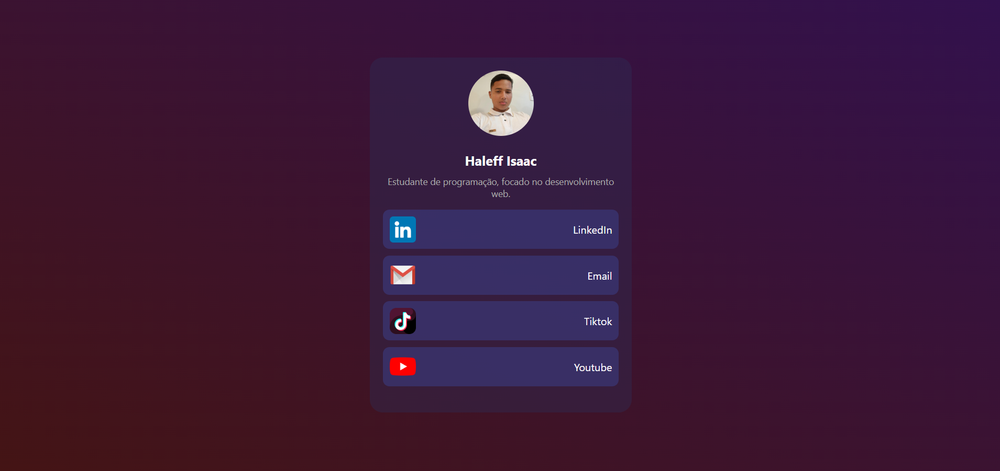

<h1 align="center">Página estática de links para biografia</h1>

Projeto desenvolvido com conceitos de HTML, CSS. 
 

    </img>

## 🚀 Tecnologias

Esse projeto foi desenvolvido com as seguintes tecnologias:

- HTML e CSS
- Git e Github

## 💻 Projeto

O projeto é uma página de links, criado através de uma aplicação interativa e funcional, de maneira simples e eficiente. Essa aplicação me permitiu consolidar os conceitos aprendidos durante as aulas e explorar as capacidades dessas tecnologias.

Por meio de uma interface simples, os usuários podem conhecer minhas redes socias e entrar em contato comigo. Para isso, usei HTML para estruturar o conteúdo da página e CSS para estilizar os elementos. [Acesse o projeto finalizado, online.](https://haleffisaac.github.io/pagina-de-links-bio/)